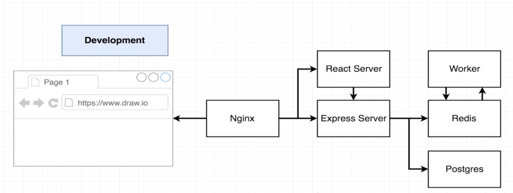

# multi-docker

This is a diagram of the development architecture, but when pushed to production some of the pieces only changed a little bit.

When a user boots up the browser and attempts to visit the application, the Nginx web server will do some routing and decide 
whether the browser is trying to access the React application to get some front end assets like the HTML or JavaScript files
that will be used to build this application. If so, Nginx will automatically route the incoming request to the React server. 

If instead the request is going to the Express API for retrieving values, then the Nginx web server will route the request to
that Express API.
